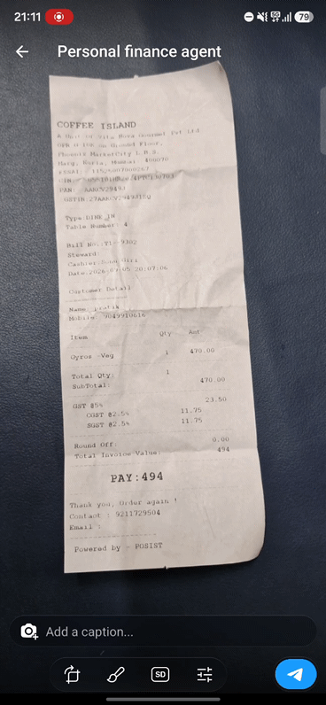

# Personal Finance Agent

[](https://github.com/PratikPatil-Dev/personal-finance-agent/actions/workflows/deploy.yml)
[](LICENSE)

A Telegram bot that acts as a personal finance assistant, built as a tool-calling AI agent from
scratch — no orchestration framework — on top of the Anthropic API.

Photograph a receipt and it reads the line items, categorises them, and logs each one as a
transaction. Tell it "spend only 3k on food this month" and it tracks that against what you
actually spend, without a budgets table existing anywhere.

<!-- TODO: drop the recording in at assets/demo.gif, then uncomment the line below.

-->


## What it does

- Log, query, update, and delete transactions through ordinary conversation
- Extract transactions from receipt photos — including an album of several photos at once
- Remember goals, budgets, preferences, habits and personal context across conversations
- Track progress against a stated budget by reasoning over stored memories plus live transaction
  data, rather than maintaining a budgets table (see `src/agent/prompts.ts`)

## How it works

```
Telegram
   │
   ├─ src/bot/index.ts ............ Telegraf handlers; buffers photo albums into one turn
   │
   ├─ src/agent/index.ts .......... runAgent: assembles context, calls Claude,
   │                                runs the tool-use loop until the model stops
   │
   ├─ src/agent/toolExecutor.ts ... dispatches tool calls, validates input with zod
   │
   └─ src/services/* .............. Mongoose CRUD, scoped per user
```

### One schema, three jobs

Tool schemas live in `src/tools/*.anthropic.tools.ts` as zod schemas. Each one is used three times:

- `z.toJSONSchema()` generates the `input_schema` the model sees
- `z.infer<>` gives the TypeScript types the services consume
- the same schema `.parse()`s the model's output at runtime in `toolExecutor.ts`

So the contract the model is shown, the types the code compiles against, and the runtime validator
cannot drift apart — they are the same object. When validation fails, the error is returned to the
model *as the tool result*, so it can correct itself instead of the turn dying.

### Three tiers of memory

Every turn assembles context from three stores with different retrieval characteristics, fetched
concurrently:

| Tier | Store | Retrieval | Holds |
|---|---|---|---|
| Episodic | MongoDB `conversations` | Last N messages, chronological | What was just said |
| Structured | MongoDB `userMemories` | Mongo `$text` search, filtered by expiry | Typed, expiring facts — goals, budgets, preferences |
| Semantic | [Supermemory](https://supermemory.ai) | Vector search + synthesised profile | Durable cross-session understanding of the user |

Structured memories carry an `expiresAt`, so a budget set for one month stops being applied the
next — the expiry is enforced in the query, in the schema, and in the system prompt.

## Running it

1. `npm install`
2. Copy `.env.example` to `.env` and fill it in — that file documents where each value comes from.
3. Generate a webhook secret for `TELEGRAM_WEBHOOK_SECRET`:
   ```bash
   node -e "console.log(require('crypto').randomBytes(32).toString('hex'))"
   ```
4. Start a tunnel (`ngrok http 8888`) and set `BASE_URL` to its HTTPS URL.
5. `npm run set-webhook` to register the webhook with Telegram.
6. `npm run dev`

> A bot token can hold only one webhook at a time, so pointing it at a local tunnel takes the
> deployed instance offline. Use a second bot from BotFather for local development.

### Scripts

| Command | What it does |
|---|---|
| `npm run dev` | Start with hot reload |
| `npm run start` | Start in production mode |
| `npm run typecheck` | `tsc --noEmit` |
| `npm run set-webhook` | Register/refresh the Telegram webhook |
| `npm run add-test-data` | Seed conversations/memories for a fixed test user |
| `npx tsx src/scripts/triggerAgent.ts` | Run `runAgent` directly, without Telegram |

## Deployment

Containerised and deployed by GitHub Actions on every push to `main`: typecheck, then a native
arm64 image build, pushed to GHCR, then an SSH deploy that pulls and restarts via Docker Compose.
It runs on an Oracle Cloud always-free ARM VM behind nginx with a Let's Encrypt certificate.

The app's own port is never exposed — Compose binds it to `127.0.0.1` and nginx is the only
public-facing service. Incoming webhooks are verified against `TELEGRAM_WEBHOOK_SECRET` with a
constant-time comparison before anything is processed.

## Notes

- `src/tools/transaction.tools.ts` and `src/tools/memory.tools.ts` hold OpenAI-style
  function-calling schemas and are not used by the running app. They are kept deliberately as
  scaffolding for a planned multi-provider (Anthropic / OpenAI / Gemini) switch — the zod schemas
  above are provider-agnostic, so only the adapter layer would change.
- Photo albums are buffered in memory per user, which means a restart mid-album drops the buffer
  and the design assumes a single running instance.

## License

MIT — see [LICENSE](LICENSE).
